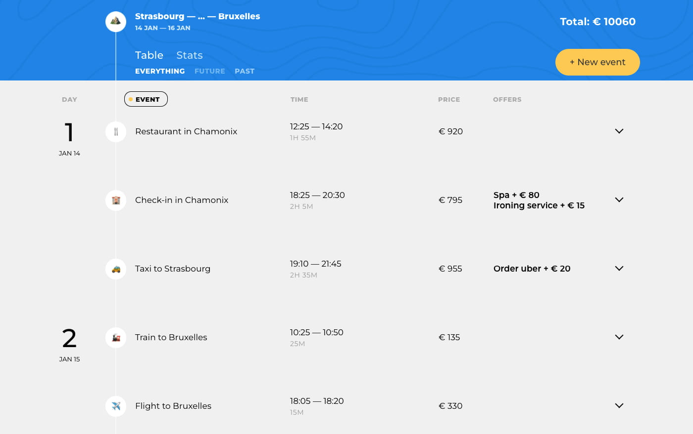

# Проект «Большое путешествие»

**Опубликованная версия доступна [тут](https://dreadwood.github.io/big-trip/)**

## О проекте

«Большое путешествие» — современный сервис для настоящих путешественников. Сервис помогает детально спланировать маршрут поездки, рассчитать стоимость путешествия и получить информацию о достопримечательностях. Минималистичный интерфейс не даст повода отвлечься и сфокусирует внимание на планировании путешествия.

### Особенности

- Проект являеться Single Page Application (SPA)
- Реализует паттерн проектирования MVP (Model-View-Presenter)
- Генерирует моковые данные для ознакомления с приложением
- Отображает статистику согласно введенным (или сгенерированным) данным с помощью [chart.js](https://www.chartjs.org/)
- Использует в качестве сборщика [webpack](https://webpack.js.org/) с плагинами, отображение календаря с помощью [flatpickr](https://flatpickr.js.org/), работа с датами и временем — [moment](https://momentjs.com/)

### В будущем

- Загрузка и обновление данных с помощью REST API
- Реализация сервера для хранения и обработки данных на Node.js
- Использования ServiceWorker для работы без интернета

## Разработка

### Основные команды:

* Установка - `npm i`
* Сборка проекта - `npm run build`
* Запуск локального сервера для разработки - `npm start`
* Запуск тестирования на соответствия код-гайдам - `npm run test`
* Обновить версию Github Pages (перед выполнением нужно собрать проект) - `gh-pages`

## Каталоги:

* Все разработка ведётся в директории `src/`
* Верстка, разметка, шрифты и изображения находятся в директории `public/`
* Итоговый код собираеться в файл `public/bundle.js`
